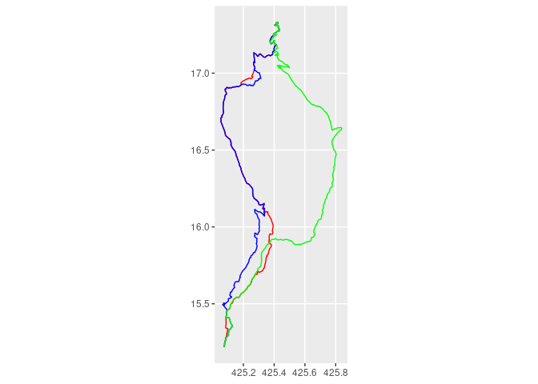

Vallhala for R
================

<!-- README.md is generated from README.Rmd. Please edit that file -->

This package is based on tests and the demo in the [setup.qmd](setup.md)
file.

## Installation

``` r
devtools::install_github("robinlovelace/rvalhalla")
```

## Usage

``` bash
# download a file to custom_files and start valhalla
mkdir custom_files
wget -O custom_files/andorra-latest.osm.pbf https://download.geofabrik.de/europe/andorra-latest.osm.pbf
docker run -dt --name valhalla_gis-ops -p 8002:8002 -v $PWD/custom_files:/custom_files -e tile_urls=https://download.geofabrik.de/europe/andorra-latest.osm.pbf ghcr.io/gis-ops/docker-valhalla/valhalla:latest
```

After that navigate to <http://localhost:8002/> and you’ll see the
endpoint.

``` r
# library(rvalhalla)
devtools::load_all()
#> ℹ Loading rvallhala
```

Let’s calculate a single route in Andorra, between two well known
places: Andorra la Vella and Pas de la Casa.

``` r
andorra_la_vella = c(1.5218, 42.5075)
pas_de_la_casa = c(1.7333, 42.5425)
```

``` r
# Calculate the route
route1 = vh_get(andorra_la_vella, pas_de_la_casa, costing = "pedestrian")
route2 = vh_get(andorra_la_vella, pas_de_la_casafrom = andorra_la_vella, to = pas_de_la_casa, costing = "bicycle")
route3 = vh_get(from = andorra_la_vella, to = pas_de_la_casa, costing = "bicycle", costing_options = list(bicycle = list(use_roads = 0.9)))
```

We can compare them with `{waldo}`:

``` r
waldo::compare(route2, route3)
#> `attr(old$geometry, 'bbox')`: 425.05 15.22 425.44 17.33
#> `attr(new$geometry, 'bbox')`: 425.07 15.22 425.84 17.33
#> 
#> `dim(old$geometry[[1]])`: 1791 2
#> `dim(new$geometry[[1]])`: 1686 2
#> 
#>       old$geometry[[1]] | new$geometry[[1]]                  
#> [192] 425.092254638672  | 425.092254638672  [192]            
#> [193] 425.092620849609  | 425.092620849609  [193]            
#> [194] 425.092681884766  | 425.092681884766  [194]            
#> [195] 425.092376708984  - 425.093963623047  [195]            
#> [196] 425.091979980469  - 425.094512939453  [196]            
#> [197] 425.091674804688  - 425.096313476562  [197]            
#> [198] 425.092559814453  - 425.097015380859  [198]            
#> [199] 425.092742919922  - 425.097503662109  [199]            
#> [200] 425.092956542969  - 425.098236083984  [200]            
#> [201] 425.092803955078  - 425.098815917969  [201]            
#>   ... ...                 ...               and 3225 more ...
```

Let’s plot them all with `ggplot2`:

``` r
library(ggplot2)
ggplot() +
  geom_sf(data = route1, color = "red") +
  geom_sf(data = route2, color = "blue") +
  geom_sf(data = route3, color = "green")
```


