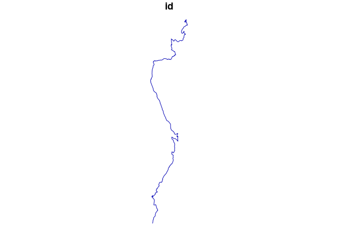

``` r
library(sf)
```

    Linking to GEOS 3.11.1, GDAL 3.6.4, PROJ 9.1.1; sf_use_s2() is TRUE

``` bash
# download a file to custom_files and start valhalla
mkdir custom_files
wget -O custom_files/andorra-latest.osm.pbf https://download.geofabrik.de/europe/andorra-latest.osm.pbf
# docker run -dt --name valhalla_gis-ops -p 8002:8002 -v $PWD/custom_files:/custom_files ghcr.io/gis-ops/docker-valhalla/valhalla:latest
# docker rmi ghcr.io/gis-ops/docker-valhalla/valhalla:latest --force # if you want to rebuild the image
# To fix this error: docker: Error response from daemon: Conflict. The container name "/valhalla_gis-ops" is already in use by container "638e172839bd6113bb3c855716a1aa92f076f8fe85e4b0faef190bff0d200c69". You have to remove (or rename) that container to be able to reuse that name.
# docker rm valhalla_gis-ops --force
# or let the container download the file for you
docker run -dt --name valhalla_gis-ops -p 8002:8002 -v $PWD/custom_files:/custom_files -e tile_urls=https://download.geofabrik.de/europe/andorra-latest.osm.pbf ghcr.io/gis-ops/docker-valhalla/valhalla:latest
```

After that navigate to http://localhost:8002/ and you’ll see the
endpoint.

Let’s calculate a single route in Andorra, between two well known
places: Andorra la Vella and Pas de la Casa.

``` r
andorra_la_vella = c(1.5218, 42.5075)
pas_de_la_casa = c(1.7333, 42.5425)
```

With reference to the
[documentation](https://valhalla.github.io/valhalla/api/optimized/api-reference/)
which states that it takes queries in the form of:

    localhost:8002/optimized_route?json={}

With contents such as

``` json
{"locations":[{"lat":40.042072,"lon":-76.306572},{"lat":39.992115,"lon":-76.781559},{"lat":39.984519,"lon":-76.6956},{"lat":39.996586,"lon":-76.769028},{"lat":39.984322,"lon":-76.706672}],"costing":"auto","directions_options":{"units":"miles"}}
```

We can construct a query URL as follows:

``` r
url_raw = 'http://localhost:8002/optimized_route?json={"locations":[{"lon":1.5218,"lat":42.5075},{"lon":1.7333,"lat":42.5425}],"costing":"auto","directions_options":{"units":"miles"}}'
json = jsonlite::fromJSON(url_raw)
names(json)
```

    [1] "trip"

``` r
names(json$trip)
```

    [1] "locations"      "legs"           "summary"        "status_message"
    [5] "status"         "units"          "language"      

``` r
names(json$trip$legs)
```

    [1] "maneuvers" "summary"   "shape"    

``` r
length(json$trip$legs$shape)
```

    [1] 1

``` r
str(json)
```

    List of 1
     $ trip:List of 7
      ..$ locations     :'data.frame':  2 obs. of  4 variables:
      .. ..$ type          : chr [1:2] "break" "break"
      .. ..$ lat           : num [1:2] 42.5 42.5
      .. ..$ lon           : num [1:2] 1.52 1.73
      .. ..$ original_index: int [1:2] 0 1
      ..$ legs          :'data.frame':  1 obs. of  3 variables:
      .. ..$ maneuvers:List of 1
      .. .. ..$ :'data.frame':  55 obs. of  17 variables:
      .. .. .. ..$ type                                  : int [1:55] 1 10 9 26 27 9 26 27 26 27 ...
      .. .. .. ..$ instruction                           : chr [1:55] "Drive east on Avinguda del Princep Benlloch." "Turn right." "Bear right onto Carrer Dr. Vilanova." "Enter Rotonda de Govern and take the 2nd exit." ...
      .. .. .. ..$ verbal_succinct_transition_instruction: chr [1:55] "Drive east. Then Turn right." "Turn right. Then Bear right onto Carrer Dr. Vilanova." "Bear right. Then Enter Rotonda de Govern and take the 2nd exit." "Enter the roundabout and take the 2nd exit." ...
      .. .. .. ..$ verbal_pre_transition_instruction     : chr [1:55] "Drive east on Avinguda del Princep Benlloch. Then Turn right." "Turn right. Then Bear right onto Carrer Dr. Vilanova." "Bear right onto Carrer Dr. Vilanova. Then Enter Rotonda de Govern and take the 2nd exit." "Enter Rotonda de Govern and take the 2nd exit." ...
      .. .. .. ..$ verbal_post_transition_instruction    : chr [1:55] "Continue for 100 feet." "Continue for 80 feet." "Continue for 500 feet." NA ...
      .. .. .. ..$ street_names                          :List of 55
      .. .. .. .. ..$ : chr "Avinguda del Princep Benlloch"
      .. .. .. .. ..$ : NULL
      .. .. .. .. ..$ : chr "Carrer Dr. Vilanova"
      .. .. .. .. ..$ : chr "Rotonda de Govern"
      .. .. .. .. ..$ : NULL
      .. .. .. .. ..$ : chr "Carrer Doctor Vilanova"
      .. .. .. .. ..$ : chr "Rotonda de Casadet"
      .. .. .. .. ..$ : chr [1:2] "Avinguda de Tarragona" "CG-1"
      .. .. .. .. ..$ : chr "Rotonda els Marginets"
      .. .. .. .. ..$ : chr [1:2] "Avinguda de Tarragona" "CG-1"
      .. .. .. .. ..$ : chr "Rotonda Josep Escaler"
      .. .. .. .. ..$ : chr "CG-1"
      .. .. .. .. ..$ : chr "Rotonda Km. 0"
      .. .. .. .. ..$ : chr "CG-2"
      .. .. .. .. ..$ : chr "Rotonda del Gall"
      .. .. .. .. ..$ : NULL
      .. .. .. .. ..$ : chr "CG-2"
      .. .. .. .. ..$ : NULL
      .. .. .. .. ..$ : chr "CG-2"
      .. .. .. .. ..$ : NULL
      .. .. .. .. ..$ : chr "CG-2"
      .. .. .. .. ..$ : NULL
      .. .. .. .. ..$ : chr "CG-2"
      .. .. .. .. ..$ : NULL
      .. .. .. .. ..$ : chr "CG-2"
      .. .. .. .. ..$ : NULL
      .. .. .. .. ..$ : chr "CG-2"
      .. .. .. .. ..$ : NULL
      .. .. .. .. ..$ : chr "CG-2"
      .. .. .. .. ..$ : chr "CG-2"
      .. .. .. .. ..$ : NULL
      .. .. .. .. ..$ : chr "CG-2"
      .. .. .. .. ..$ : NULL
      .. .. .. .. ..$ : chr "CG-2"
      .. .. .. .. ..$ : NULL
      .. .. .. .. ..$ : chr "CG-2"
      .. .. .. .. ..$ : NULL
      .. .. .. .. ..$ : chr "CG-2"
      .. .. .. .. ..$ : NULL
      .. .. .. .. ..$ : chr "CG-2"
      .. .. .. .. ..$ : NULL
      .. .. .. .. ..$ : chr "CG-2"
      .. .. .. .. ..$ : NULL
      .. .. .. .. ..$ : chr "CG-2"
      .. .. .. .. ..$ : NULL
      .. .. .. .. ..$ : chr "CG-2"
      .. .. .. .. ..$ : chr "CG-2a"
      .. .. .. .. ..$ : NULL
      .. .. .. .. ..$ : chr "Avinguda del Consell General"
      .. .. .. .. ..$ : chr "Avinguda del Consell General"
      .. .. .. .. ..$ : NULL
      .. .. .. .. ..$ : chr "Carrer de les Abelletes"
      .. .. .. .. ..$ : chr "Carrer de Sant Jordi"
      .. .. .. .. ..$ : NULL
      .. .. .. .. ..$ : NULL
      .. .. .. ..$ time                                  : num [1:55] 2.88 2.572 12.183 1.876 0.981 ...
      .. .. .. ..$ length                                : num [1:55] 0.024 0.015 0.101 0.013 0.008 0.092 0.025 0.269 0.007 0.218 ...
      .. .. .. ..$ cost                                  : num [1:55] 2.74 11.71 38.15 7.5 6.55 ...
      .. .. .. ..$ begin_shape_index                     : int [1:55] 0 3 9 29 41 44 54 64 83 87 ...
      .. .. .. ..$ end_shape_index                       : int [1:55] 3 9 29 41 44 54 64 83 87 103 ...
      .. .. .. ..$ verbal_multi_cue                      : logi [1:55] TRUE TRUE TRUE NA TRUE TRUE ...
      .. .. .. ..$ travel_mode                           : chr [1:55] "drive" "drive" "drive" "drive" ...
      .. .. .. ..$ travel_type                           : chr [1:55] "car" "car" "car" "car" ...
      .. .. .. ..$ verbal_transition_alert_instruction   : chr [1:55] NA "Turn right." "Bear right onto Carrer Dr. Vilanova." "Enter Rotonda de Govern and take the 2nd exit." ...
      .. .. .. ..$ roundabout_exit_count                 : int [1:55] NA NA NA 2 NA NA 2 NA 2 NA ...
      .. .. .. ..$ toll                                  : logi [1:55] NA NA NA NA NA NA ...
      .. ..$ summary  :'data.frame':    1 obs. of  11 variables:
      .. .. ..$ has_time_restrictions: logi FALSE
      .. .. ..$ has_toll             : logi TRUE
      .. .. ..$ has_highway          : logi FALSE
      .. .. ..$ has_ferry            : logi FALSE
      .. .. ..$ min_lat              : num 42.5
      .. .. ..$ min_lon              : num 1.52
      .. .. ..$ max_lat              : num 42.6
      .. .. ..$ max_lon              : num 1.74
      .. .. ..$ time                 : num 1714
      .. .. ..$ length               : num 17.2
      .. .. ..$ cost                 : num 1854
      .. ..$ shape    : chr "_mmapAai{{A[iEuBsTIu@?uBNqAb@_Av@k@|@e@dBUd@?bAEbDCrELpCh@fBn@bBrAjAzAfBhE~@jC~@lCtIxZv@|@n@Rt@@|@KtHw@~@HpAh@p"| __truncated__
      ..$ summary       :List of 11
      .. ..$ has_time_restrictions: logi FALSE
      .. ..$ has_toll             : logi TRUE
      .. ..$ has_highway          : logi FALSE
      .. ..$ has_ferry            : logi FALSE
      .. ..$ min_lat              : num 42.5
      .. ..$ min_lon              : num 1.52
      .. ..$ max_lat              : num 42.6
      .. ..$ max_lon              : num 1.74
      .. ..$ time                 : num 1714
      .. ..$ length               : num 17.2
      .. ..$ cost                 : num 1854
      ..$ status_message: chr "Found route between points"
      ..$ status        : int 0
      ..$ units         : chr "miles"
      ..$ language      : chr "en-US"

We can convert the `$shape` column to a `sf` object and plot it.

``` r
remotes::install_cran("googlePolylines")
```

    Skipping install of 'googlePolylines' from a cran remote, the SHA1 (0.8.4) has not changed since last install.
      Use `force = TRUE` to force installation

``` r
line = googlePolylines::decode(json$trip$legs$shape)
class(line)
```

    [1] "list"

``` r
length(line)
```

    [1] 1

``` r
class(line[[1]])
```

    [1] "data.frame"

``` r
line_sf = sfheaders::sf_linestring(line[[1]])
plot(line_sf)
```


Let’s create a function that does that with the `httr2` package and
using the `RcppSimdJson` package to parse the JSON:

``` r
library(httr2)
library(RcppSimdJson)
vh_get_test = function(resource = "optimized_route", from, to, costing = "auto", url = "http://localhost:8002/", ...) {

  params = list(
    locations = list(
        list(lon = from[1], lat = from[2]),
        list(lon = to[1], lat = to[2])
      ),
      costing = costing,
      directions_options = list(units = "miles"),
      ...
    )
#   names(params) = paste0("_", names(params))
  
  request(url) |> 
    req_url_path_append(resource) |> 
    req_body_json(params) |> 
    # req_user_agent("my_package_name (http://my.package.web.site)") |> 
    req_perform() |> 
    resp_body_json()
}
vh_sf = function(json) {
  line = googlePolylines::decode(json$trip$legs[[1]]$shape)
  line_sf = sfheaders::sf_linestring(line[[1]])
  line_sf
}
```

``` r
route_example = vh_get_test(from = andorra_la_vella, to = pas_de_la_casa)
# str(route_example)
```

``` r
route_example_sf = vh_sf(route_example)
```

``` r
route_example_bike = vh_get_test(from = andorra_la_vella, to = pas_de_la_casa, costing = "bicycle")
route_example_bike_sf = vh_sf(route_example_bike)
```

<div>

``` r
plot(route_example_sf)
plot(route_example_bike_sf)
```

<div>

<table>
<colgroup>
<col style="width: 50%" />
<col style="width: 50%" />
</colgroup>
<tbody>
<tr class="odd">
<td style="text-align: center;"><div width="50.0%"
data-layout-align="center">
<p></p>
</div></td>
<td style="text-align: center;"><div width="50.0%"
data-layout-align="center">
<p></p>
</div></td>
</tr>
</tbody>
</table>

</div>

</div>

Next we’ll try to change the costing based on the following exmaple from
the documentation:

> `use_roads` A cyclist’s propensity to use roads alongside other
> vehicles. This is a range of values from 0 to 1, where 0 attempts to
> avoid roads and stay on cycleways and paths, and 1 indicates the rider
> is more comfortable riding on roads. Based on the use_roads factor,
> roads with certain classifications and higher speeds are penalized in
> an attempt to avoid them when finding the best path. The default value
> is 0.5.

That can be done by adding the `use_roads` parameter to the
`directions_options` list:

``` r
route_example_bike_roads = vh_get_test(from = andorra_la_vella, to = pas_de_la_casa, costing = "bicycle", costing_options = list(bicycle= list(use_roads = 0.1)))
route_example_bike_roads_sf = vh_sf(route_example_bike_roads)

plot(route_example_bike_roads_sf$geometry)
plot(route_example_bike_sf$geometry, add = TRUE, col = "red")
```


``` r
waldo::compare(route_example_bike_roads_sf, route_example_bike_sf)
```

    `attr(old$geometry, 'bbox')`: "((425.0536,15.21825),(425.436,17.33257))" 
    `attr(new$geometry, 'bbox')`: "((425.0533,15.21825),(425.4358,17.33257))"

    `dim(old$geometry[[1]])`: 1774 2
    `dim(new$geometry[[1]])`: 1791 2

         unclass(old$geometry[[1]]) | unclass(new$geometry[[1]])                  
    [24] 425.080871582031           | 425.080871582031           [24]             
    [25] 425.081024169922           | 425.081024169922           [25]             
    [26] 425.081665039062           | 425.081665039062           [26]             
    [27] 425.082305908203           - 425.082214355469           [27]             
    [28] 425.082580566406           - 425.082550048828           [28]             
    [29] 425.083038330078           - 425.082794189453           [29]             
    [30] 425.083282470703           - 425.082977294922           [30]             
    [31] 425.083343505859           - 425.083190917969           [31]             
    [32] 425.083374023438           - 425.083312988281           [32]             
    [33] 425.08349609375            - 425.083862304688           [33]             
     ... ...                          ...                        and 1947 more ...
